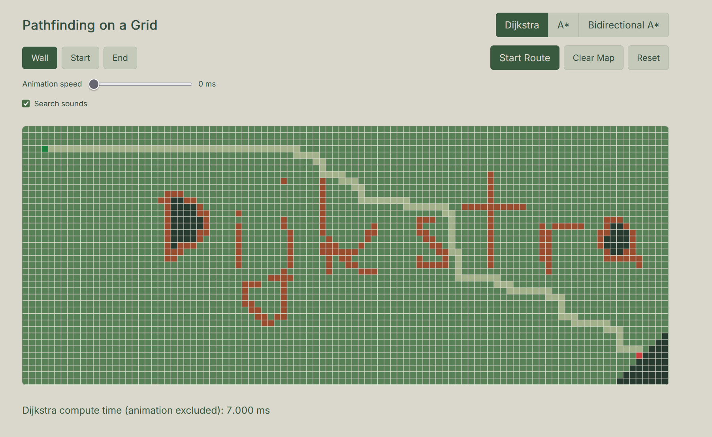
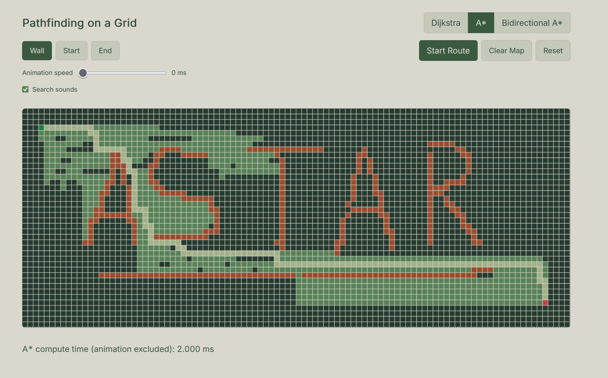
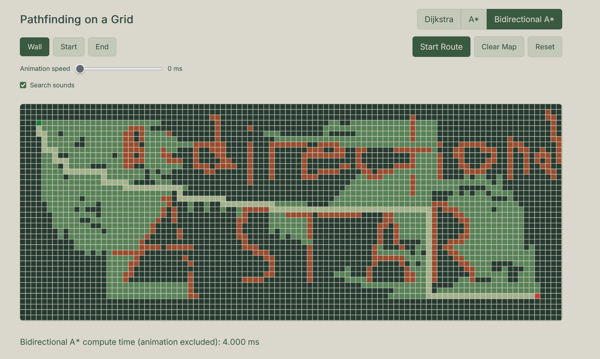
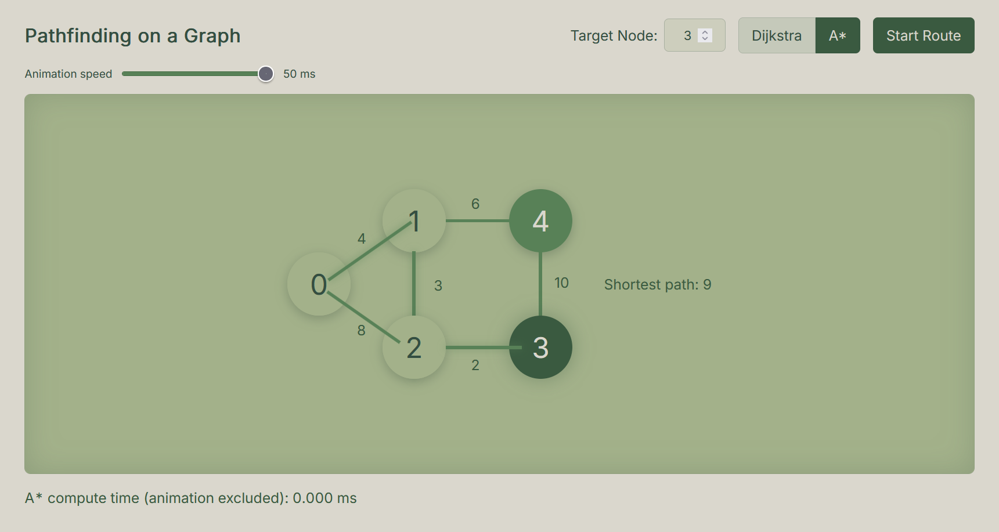
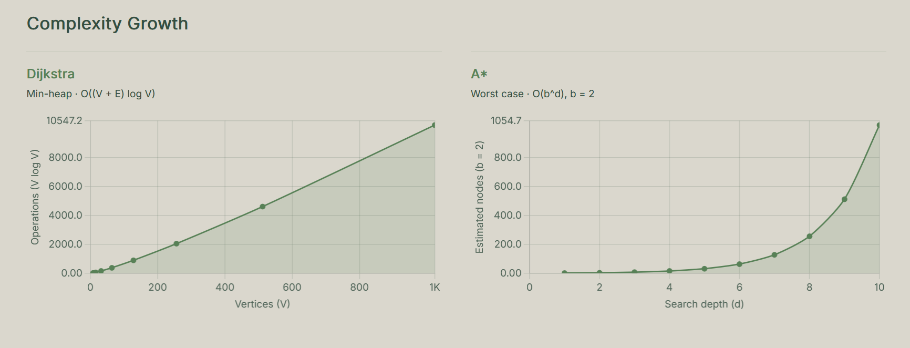

<div align="center">

# Pathfinding Visualizer

**A hands-on model of how digital maps find routes**

We built these visualizations to explain the basic idea behind route-finding in services such as Google Maps: represent possible roads as a graph, assign costs to routes, and search for a good path between two places.

**School project · Class 5G · ITTS O. Belluzzi L. da Vinci, Rimini**

</div>

---

## Demo

Watch the full walkthrough below, or [open/download the MP4](./src/assets/AllAlgorithmsVideo.mp4) directly.

<video controls playsinline preload="metadata" width="100%">
	<source src="./src/assets/AllAlgorithmsVideo.mp4" type="video/mp4">
	Your browser does not support embedded video. Use the MP4 link above.
</video>

## Project

We built these visualizations to show, in a simplified way, how a digital map can find a route from a starting point to a destination. 


A useful model is a graph: intersections are nodes, roads connecting them are edges, and each edge has a cost. 


A route planner searches those connections and compares route costs, which can represent distance or estimated travel time. 


Real navigation services can also account for factors such as traffic, road restrictions, and changing conditions.


Our project makes that idea small enough to see step by step. 


In the editable grid, cells act like locations and walls block movement; in the weighted graph, nodes represent places and edges have different costs. 


Dijkstra, A*, and Bidirectional A* explore possible routes, and the animation reveals the explored area and the route each search returns. 


This helps us compare how the algorithms work and why a heuristic can guide a search toward its destination.

This is an informatics project for **ITTS O. Belluzzi L. da Vinci in Rimini, class 5G**, developed by **Zaim Halili** in collaboration with **Penda Dieng** and **Mattia Innocenti**.

## Screenshots

### Dijkstra on the grid



### A* on the grid



### Bidirectional A* on the grid



### A* on a weighted graph



### Complexity growth charts



The charts show theoretical growth estimates for the selected input sizes; they are not runtime benchmark results.

## Features

- Run Dijkstra, A*, or Bidirectional A* on a 40-by-100 grid.
- Draw and erase walls, and reposition the start and goal cells.
- Animate explored cells and the final route; adjust the animation speed or toggle search sounds.
- Compare Dijkstra and A* on a weighted, five-node graph and choose a target node.
- See search-computation time separately from route animation time.
- View illustrative growth curves for Dijkstra and A*.
- Use the interface on desktop and smaller screens.

## Algorithms at a glance

| Algorithm | Where it runs | Search strategy |
| --- | --- | --- |
| Dijkstra | Grid and weighted graph | Expands the lowest known path cost first; finds a shortest path with non-negative edge weights. |
| A* | Grid and weighted graph | Prioritizes path cost plus a distance-to-go estimate. The grid uses Manhattan distance; the graph uses a coordinate-based heuristic. |
| Bidirectional A* | Grid | Searches from the start and goal, alternating between the two frontiers until the searches meet. |

The grid uses four-directional movement with a cost of one per step. The sample graph uses weighted edges, so its shortest route is determined by accumulated edge cost rather than the number of edges.

## Run locally

This is a vanilla HTML, CSS, and JavaScript project: there is no build step, package installation, or Python requirement. Open the project in VS Code, install the **Live Server** extension, then right-click `index.html` and choose **Open with Live Server**. It serves the app on `127.0.0.1` (port `5500` by default; use the address VS Code opens if your port differs). A local web server is needed so the browser can load JavaScript modules correctly.

Tailwind CSS and Chart.js are loaded from CDNs, so an internet connection is needed for those libraries. The pathfinding algorithms and visualizer code are in this repository.

## How to use

1. In **Pathfinding on a Grid**, choose an algorithm.
2. Select **Wall**, **Start**, or **End**, then click or drag on the grid to edit it.
3. Adjust animation speed and sound if desired, then select **Start Route**.
4. Use **Clear Map** to remove walls or **Reset** to restore the grid and default endpoints.
5. In **Pathfinding on a Graph**, choose a target node and algorithm, then select **Start Route**.

## Project structure

```text
.
├── index.html
├── main.js
├── style.css
└── src/
		├── Algorithms/   # Dijkstra, A*, and Bidirectional A*
		├── Audio/        # Search sound effects
		├── Data/         # Sample weighted graph and heuristic
		├── Models/       # Min-heap priority queue
		├── Renderers/    # Grid, graph, and complexity chart rendering
		├── Utils/        # Animation frame scheduling
		└── assets/       # Screenshots and the demo video
```

## Built with

- HTML, CSS, and vanilla JavaScript modules
- HTML Canvas for the interactive grid
- [Tailwind CSS](https://tailwindcss.com/) via CDN
- [Chart.js](https://www.chartjs.org/) via CDN

---

<div align="center">

**Zaim Halili · Penda Dieng · Mattia Innocenti**  
Informatics project · Class 5G · ITTS O. Belluzzi L. da Vinci · Rimini

</div>
